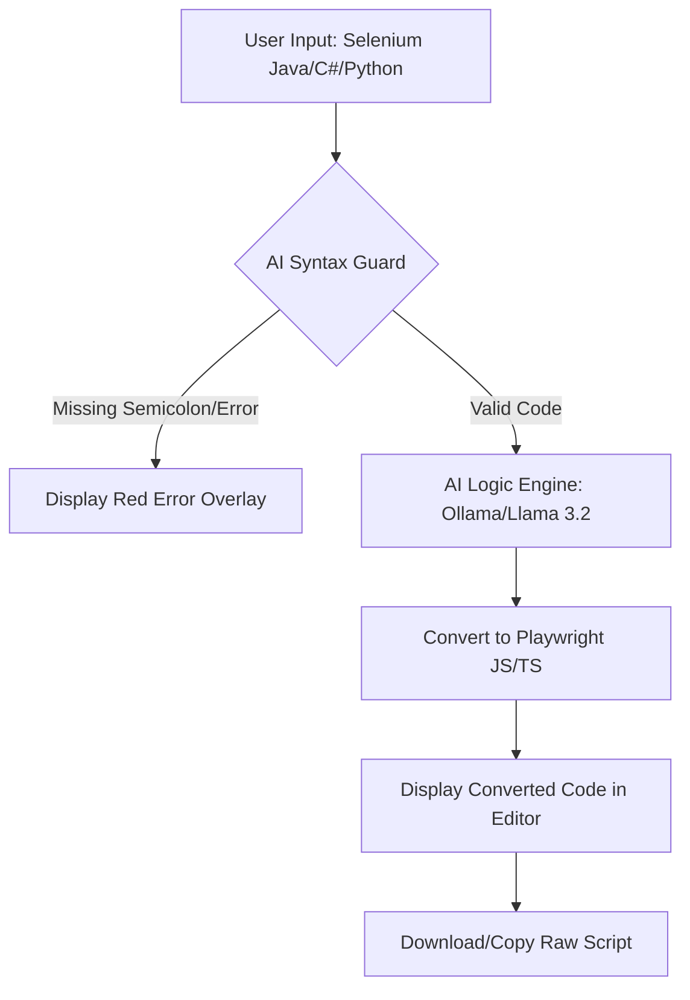

# AI Universal Script Converter - Technical Documentation

## 🔄 System Flow Graph


## Overview
A Tier-1 premium web application designed to migrate legacy automation scripts (Selenium Java, C#, Python, etc.) to modern Playwright JavaScript/TypeScript using local LLM orchestration (Ollama).

## Architecture (A.N.T. Protocol)
- **Layer 1: Architecture (`architecture/`)**: Defined logic for TestNG mapping and syntax validation rules.
- **Layer 2: Navigation (`index.html`)**: The core UI that handles user interaction and routes logic to the LLM.
- **Layer 3: Tools (`tools/`)**: PowerShell automation scripts for CLI-based conversion.

## Features
- **Universal Input**: Supports Selenium (Java, Python, C#), Puppeteer, and standard JS tests.
- **Strict Syntax Safety**: AI-driven validation detects missing semicolons and unclosed braces before conversion.
- **Local LLM**: Powered by `llama3.2` via Ollama for privacy and speed.
- **Premium UI**: Glassmorphism design, animated backgrounds, and real-time status tracking.

## Deployment & Setup
1. **Ollama Setup**:
   - Install Ollama from [ollama.ai](https://ollama.com).
   - Pull the model: `ollama pull llama3.2`.
   - **CRITICAL**: Run Ollama with CORS enabled for browser communication:
     ```powershell
     $env:OLLAMA_ORIGINS="*"; ollama serve
     ```
2. **Usage**:
   - Open `index.html` in any modern browser.
   - Paste source code and click **Convert Now**.

## 🌐 Hosting & Deployment

The application is structured for both local use and containerized hosting.

### 1. Build the Production UI
First, build the optimized frontend assets:
```bash
npm run build
```

### 2. Local Network Hosting
Start the Express server:
```bash
npm start
```
Others on your network can access the tool via `http://YOUR_LOCAL_IP:3001`.

### 3. Docker Deployment
Use the included `Dockerfile` to containerize the app:
```bash
docker build -t playwright-converter .
docker run -p 3001:3001 playwright-converter
```
*Note: The container uses `host.docker.internal` to communicate with Ollama on your host machine.*
